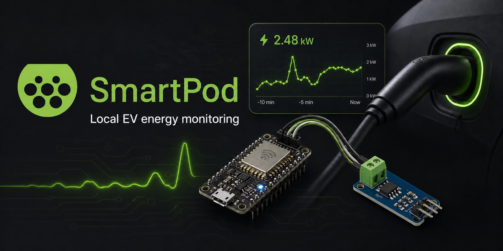
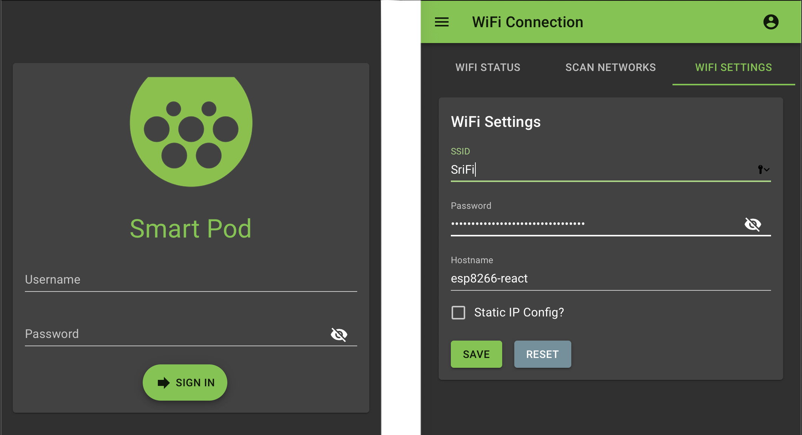

<div align="center">



# SmartPod

Local, browser-based EV charging energy monitoring with an ESP8266 and an ACS712 sensor.

[](https://github.com/sraodev/SmartPod/actions/workflows/ci.yml)
[](https://platformio.org/)
[](https://react.dev/)
[](LICENSE.txt)

[Try the interactive demo](https://sraodev.github.io/SmartPod/) · [See the dashboard](#dashboard) · [Build it](#quick-start) · [Explore SmartPod v2](docs/architecture-v2.md) · [Contribute](CONTRIBUTING.md)

</div>

SmartPod is an open-source hardware prototype that samples AC current, derives instantaneous power from a configured line voltage, and serves the readings from the device itself. Its responsive React dashboard, Wi-Fi setup, REST API, NTP sync, and OTA configuration all run locally—no cloud account or subscription required.

> [!WARNING]
> SmartPod is a monitoring prototype, not a certified EVSE, safety controller, or revenue-grade meter. It does not switch mains power or negotiate with a vehicle. Mains wiring can cause fire, injury, or death; use an isolated bench setup and involve a qualified electrician before connecting anything to a charging circuit.

## Why SmartPod?

- **Local-first:** firmware, configuration, API, and dashboard stay on the device.
- **Maker-friendly:** the legacy prototype uses a widely available ESP8266 board and an ACS712 current sensor.
- **Useful IoT foundation:** includes Wi-Fi provisioning, an access-point fallback, NTP, OTA configuration, and authenticated REST endpoints.
- **Hackable end to end:** PlatformIO/C++ firmware and a React/Material UI front end live in one repository.
- **Honest scope:** implemented behavior and planned work are separated below so you can evaluate the project quickly.

## Dashboard

### Hardware-free SmartPod Lab

The [interactive demo](https://sraodev.github.io/SmartPod/) runs entirely in the browser. Start or stop a simulated energy session, adjust its current limit and tariff, watch live power and cumulative energy, disconnect the network, or inject a thermal fault. It uses no real payment and cannot control hardware.

Run the same demo locally with `npm start`, then open [`http://localhost:3000/demo`](http://localhost:3000/demo).

### Legacy device dashboard



The on-device dashboard currently exposes:

| Reading | Source |
| --- | --- |
| Current (A) | Sampled from the ACS712 |
| Voltage (V) | Configured nominal line voltage; not independently measured |
| Power (W) | Calculated as configured voltage × measured current |
| Energy and cost | Present in the API/UI model, but not yet production-ready; see [Project status](#project-status) |

It also provides screens for Wi-Fi, access-point, NTP, OTA, user, and system settings.

## How it works

```text
AC current ──> ACS712 ──analog sample──> ESP8266
                                           │
                    ┌──────────────────────┼──────────────────────┐
                    │                      │                      │
              SmartPodService       REST/JSON API        SPIFFS settings
                    │                      │
                    └──────────────> React dashboard
                                      on your LAN
```

The firmware reads the sensor in `SmartPodService`, exposes status at `/rest/smartpodStatus`, and serves the compiled interface from SPIFFS. Configuration services persist JSON under `data/config`.

## Project status

SmartPod is an early hardware prototype being refreshed after its original 2019 development cycle. Treat it as a foundation for experimentation, not a finished charger product.

| Capability | Status |
| --- | --- |
| ACS712 AC current sampling | Implemented |
| Instantaneous power | Implemented from nominal voltage × current |
| Local React dashboard | Implemented |
| Wi-Fi/AP/NTP/OTA configuration | Implemented |
| Authenticated settings API | Implemented with important limitations below |
| Cumulative kWh and tariff billing | In progress |
| Charging-session history and charts | Planned |
| Vehicle/EVSE control, pilot signaling, protection | Out of scope |

Security notes:

- The checked-in image has public demo credentials and secrets. Change them before flashing hardware.
- The web server uses HTTP, so credentials and bearer tokens are not protected from someone who can observe the local network.
- Tokens do not currently expire. Use SmartPod only on a trusted, isolated network while the security model is being modernized.

See [ROADMAP.md](ROADMAP.md) for the focused path forward and [SECURITY.md](SECURITY.md) for responsible reporting.

Firmware diagnostics use [structured serial logging](docs/logging.md): JSON by default, configurable severity, bounded records, and an optional human-readable format. Application logs exclude Wi-Fi names, addresses, credentials, tokens, and request bodies. No cloud log collection is added.

[Preview release verification](docs/releases.md) adds exact-source manifests,
dependency inventories, tamper checks, and GitHub provenance for future firmware
previews. It does not make the legacy hardware production-ready or prove byte-identical rebuilds.

## SmartPod v2 direction

The next version is designed as an open, hardware-adaptable energy-control platform rather than a larger ESP demo. A real-time MCU controller owns metering, interlocks, and actual output state; an optional Raspberry Pi/Linux gateway owns offline operation and hardware adapters; the app/control plane owns users, tariffs, session history, and payment-provider integrations.

That architecture can support an ESP, STM32, RP2040, existing EVSE controller, certified Modbus meter, or simulator behind the same port/session API. It deliberately keeps Raspberry Pi, cloud, and payment failures out of the immediate mains-safety loop.

Read the full [SmartPod v2 architecture and phased delivery plan](docs/architecture-v2.md) or inspect the draft [OpenAPI contract](docs/openapi-v2.yaml).

The [local Go/SQLite gateway preview](docs/gateway.md) now provides authenticated,
read-only port endpoints with persistent synthetic readings. It runs on loopback
only and has no hardware control, payments, or browser integration. The
[read-only CLI](docs/cli.md) adds status, port list/detail, help/version, and stable
JSON output. Build both from source; CLI release installer assets are not published.

## Hardware

For a bench prototype you need:

| Component | Notes |
| --- | --- |
| ESP-12E/ESP8266 development board | The checked-in PlatformIO environment targets a 4 MB ESP-12E layout |
| ACS712 current-sensor module | Choose the 5 A, 20 A, or 30 A variant for the expected current range |
| Isolated low-voltage power supply and USB cable | Powers and programs the controller |

The current firmware defaults to an ESP-12E and analog pin `A0`. Cheap sensor modules vary in isolation, creepage, calibration, and accuracy; inspect the exact module and use suitable enclosure and over-current protection.

## Quick start

### Read-only CLI (source build)

With Go 1.25+, build the CLI without any hardware:

```sh
cd gateway
go build -o build/smartpod ./cmd/smartpod
./build/smartpod help
./build/smartpod --version
```

Follow the [gateway + CLI quickstart](docs/cli.md) for authenticated `status`,
`ports`, and `--json` reads. Simulator values are synthetic, not physical output
feedback or billable energy; no control or payment commands are available.

### Future CLI installer (GitHub-only)

The repository includes a [checksum-verifying CLI installer](install.sh). **CLI binaries are not published yet**: the existing ESP8266 preview contains firmware, not a CLI. The installer fails clearly until a compatible CLI release exists; use the browser demo or the source-build quickstarts today.

Once CLI release assets are published:

```sh
curl --proto '=https' --tlsv1.2 -fsSL https://raw.githubusercontent.com/sraodev/SmartPod/master/install.sh | sh
```

The script comes from this repository and binaries/checksums come from GitHub Releases. No Cloudflare, external install service, sudo, or automatic shell-profile changes. See [installation options and release requirements](docs/cli-installation.md). CLI work, the terminal banner, and other enhancements are linked in [the enhancement tracker](https://github.com/sraodev/SmartPod/issues/12).

### Prerequisites

- [Git](https://git-scm.com/)
- [PlatformIO Core](https://docs.platformio.org/en/latest/core/installation/index.html)
- A supported Node.js/npm version (the CI workflow is the source of truth)
- An ESP board and USB serial connection for flashing

### 1. Clone the repository

```bash
git clone https://github.com/sraodev/SmartPod.git
cd SmartPod
```

### 2. Build the dashboard

```bash
cd interface
npm ci
npm run build
cd ..
```

The build copies the compressed interface into `data/www` for the device filesystem image.

### 3. Build the firmware

```bash
platformio run
```

### 4. Flash firmware and filesystem

Connect the board and let PlatformIO auto-detect its serial port:

```bash
platformio run --target upload
platformio run --target uploadfs
```

If detection fails, append `--upload-port <your-port>` to either command instead of committing a machine-specific port.

On first boot, the checked-in filesystem contains no shared administrator,
JWT, Wi-Fi, access-point, or OTA password. Complete the documented
[one-time local provisioning flow](docs/first-boot-provisioning.md) before
normal administration. The temporary setup access point is intentionally open,
so provision only while physically near the device and never in a public place.

## Local interface development

The development server can talk to a SmartPod device on your LAN:

1. Set `REACT_APP_ENDPOINT_ROOT` in `interface/.env.development` to the device REST root.
2. Enable the `ENABLE_CORS` build flag in `platformio.ini` and keep `CORS_ORIGIN` restricted to the development-server origin.
3. Start the UI:

```bash
cd interface
npm start
```

## Repository layout

| Path | Purpose |
| --- | --- |
| `src/` | ESP firmware, services, authentication, and sensor logic |
| `interface/` | React dashboard source |
| `data/config/` | Filesystem settings included in the flash image |
| `data/www/` | Generated dashboard assets; intentionally ignored by Git |
| `media/` | README and social-preview assets |
| `platformio.ini` | Board, framework, dependency, and upload configuration |

## Contributing

The most valuable contributions right now are reproducible hardware test results, energy-integration/calibration work, and build modernization. Start with [CONTRIBUTING.md](CONTRIBUTING.md), then open a focused issue or pull request.

If this prototype gives you a useful starting point, starring the repository helps other ESP and EV makers find it.

## Acknowledgements

SmartPod's device-management foundation was adapted from [esp8266-react](https://github.com/rjwats/esp8266-react). The project also uses ArduinoJson, ESPAsyncWebServer, NtpClientLib, the Arduino Time library, and an ACS712 sensor library.

## License

SmartPod is available under the [GNU Lesser General Public License v3.0](LICENSE.txt).
