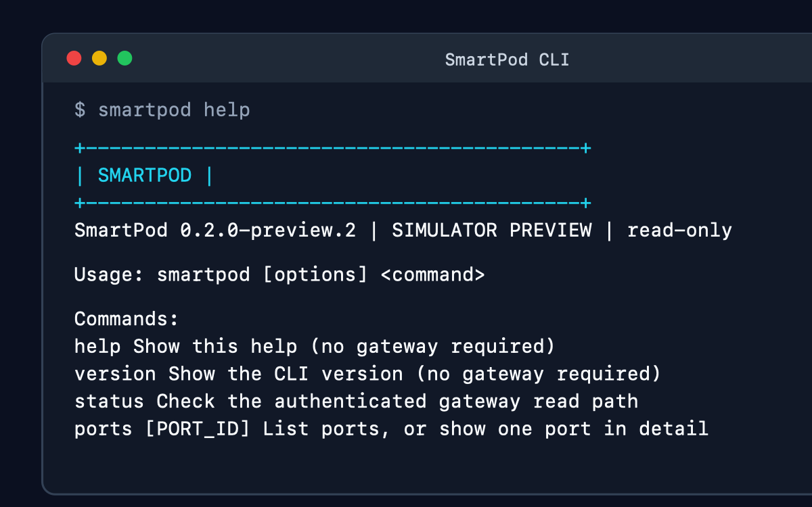

# Read-only SmartPod CLI

The source-built `smartpod` CLI reads the [local gateway](gateway.md). It has no
start/stop commands, hardware writes, payment operations, or token store.
Release binaries are **not published yet**; the [curl installer](cli-installation.md)
still needs a compatible CLI release. No extra Go dependencies or CLI framework.

## Reproducible quickstart

Requires Go 1.25+ and a trusted local machine. From the repository root, in one shell:

```sh
cd gateway
go build -o build/smartpod-gateway .
go build -o build/smartpod ./cmd/smartpod
./build/smartpod help
./build/smartpod --version
export SMARTPOD_GATEWAY_TOKEN="$(openssl rand -hex 32)"
./build/smartpod-gateway -db smartpod-gateway.db &
smartpod_gateway_pid=$!
# Allow up to five seconds for startup; readiness checks do not print credentials.
for attempt in 1 2 3 4 5; do
  ./build/smartpod status >/dev/null 2>&1 && break
  sleep 1
done
./build/smartpod status
./build/smartpod ports
./build/smartpod ports sim-port-1
./build/smartpod --json ports sim-port-1
kill "$smartpod_gateway_pid"
wait "$smartpod_gateway_pid"
unset SMARTPOD_GATEWAY_TOKEN
```

The database remains on disk; reusing it resumes the replay. Help and version
need no token or running gateway. Source builds report `smartpod dev`; an explicit
build version can be set with `go build -ldflags '-X main.version=<version>'`.
That value is build metadata, not proof of a published release.

## Commands and options

Put options **before** the command. `--help`/`-h` and `--version` are aliases for
`help` and `version`; no arguments shows help. JSON help is not supported.

```sh
./build/smartpod --endpoint http://127.0.0.1:8081/api --timeout 2s --json status
./build/smartpod --endpoint 'http://[::1]:8080/api' ports
```

`--endpoint` defaults to `http://127.0.0.1:8080/api`; a trailing slash is accepted.
Only numeric loopback HTTP URLs with an explicit port (1–65535) and `/api` path
are allowed. Hostnames, LAN/public addresses, URL credentials, query strings,
and fragments are rejected. The gateway must listen on that exact address/port.
There is no proxy or redirect support and no automatic retry. `--timeout` covers
the entire request, including body reads: default 5s, allowed range 1ms–30s.
Responses are limited to 1 MiB and checked for JSON, required fields, field types,
enums, timestamps, nonnegative counters, duplicate port IDs, and detail ID matches.
Unknown fields fail closed against the current contract.

The only credential input is `SMARTPOD_GATEWAY_TOKEN` (32–256 printable non-space
ASCII characters, same as the gateway). Generate a random development token;
never put it in arguments or URLs. Errors omit raw arguments, URLs, transport
errors, headers, and server bodies. Returned credential echoes are rejected.
Nothing saves credentials or changes your shell profile. Loopback HTTP is not
TLS: privileged local processes may still inspect environments and traffic.
Do not expose this preview via tunnels or reverse proxies.

`status` and `ports` each make one authenticated `GET /api/v1/ports`.
`ports PORT_ID` makes one `GET /api/v1/ports/PORT_ID`. A CLI port ID is 1–128 ASCII
letters, digits, hyphens, or underscores, and cannot start with a hyphen.

## Interactive banner

A compact ASCII mark identifies interactive human-readable output:



```text
+------------------------------------------+
| SMARTPOD                                 |
+------------------------------------------+
SmartPod dev | SIMULATOR PREVIEW | read-only
```

Color changes only the mark; the words carry all meaning. The banner is shown
only when stdout is a terminal and the command produces successful human-readable
output. It is absent from JSON, `version`/`--version`, redirected or piped output,
and all failures. Use `--no-banner` to suppress it. Use `--no-color`, or set
`NO_COLOR` to any value (including empty), to keep the banner while suppressing
ANSI color. The plain banner is ASCII, has no animation or flashing, and every
line fits within 80 columns.

## Stable JSON and exit codes

`--json` emits one newline-terminated JSON object on stdout, without banners,
progress text, or diagnostic lines. Successful commands leave stderr empty.
Object key order is not an API; consumers must parse JSON. Version 1 shapes:

| Invocation | JSON shape |
| --- | --- |
| `--json version` | `{"schema_version":1,"command":"version","version":"dev"}` |
| `--json status` | `{"schema_version":1,"command":"status","reachable":true,"port_count":1}` |
| `--json ports` | `{"schema_version":1,"command":"ports","ports":[PORT]}` |
| `--json ports sim-port-1` | `{"schema_version":1,"command":"port","port":PORT}` |

`PORT` follows [OpenAPI's Port schema](openapi-v2.yaml), including measurement
quality and integer units (`mV`, `mA`, `W`, `Wh`). Absent `active_session_id` is
normalized to `null`; an empty port list remains `[]`. No charges are calculated.
Incompatible output changes require a new `schema_version`.

| Exit | Meaning |
| --- | --- |
| 0 | Success; status means the authenticated read API responded, not device health |
| 1 | Output could not be written |
| 2 | Invalid arguments, endpoint, timeout, or token configuration |
| 3 | Connection/timeout/read failure or non-200 HTTP status, including auth failure, missing port, and refused redirects |
| 4 | Malformed, oversized, or incompatible gateway response |

Failures leave stdout empty and write a short diagnostic to stderr (except that
an output-write failure can leave partial stdout). Do not parse diagnostic text;
use the exit code. No JSON success object is emitted for a failed read.

## Safety and verification

`reachable: true` is **not** a hardware, safety, freshness, or billing verdict.
The current gateway's `active`/`closed` states and `estimated` measurements are
synthetic. Replay timestamps are not wall-clock freshness, and whole Wh must
not be repriced into a bill. The CLI neither energizes loads nor processes money.
All [electrical-safety restrictions](../README.md) remain in force.

```sh
cd gateway
go test -race ./...
go vet ./...
cd ..
node scripts/test-gateway-contract.cjs
```

The final check requires the existing frontend validation dependencies installed
(`npm --prefix interface ci`). It builds both binaries and tests CLI reads against
a real authenticated gateway, plus gateway contract validation and restart
continuity. Command tests use local HTTP test servers for success, input errors,
auth/HTTP failures, timeouts, redirects/proxies, malformed responses, credential
echoes, and clean JSON/stdout separation. This is software verification only,
not Raspberry Pi runtime, physical metering, mains safety, or release-install proof.
